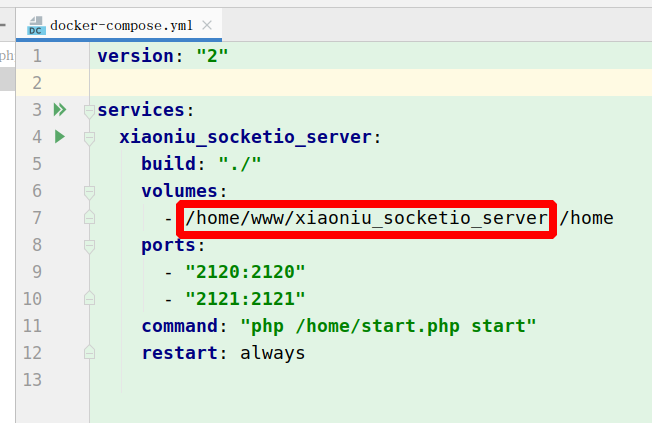

# 小牛简易socketio推送服务（xiaoniu_socketio_server）


### 特性

* 基于workerman 实现

* 支持API动态推送

* 支持一对一，分组推送

* 支持离线推送

* 未授权，则无法接收推送信息，断掉链接

* 数据安全，简单操作

* Docker 一键安装，方便使用

[体验地址](http://xiaoniu_socketio_client.demo.aniulee.com/ "体验地址")

### 更新记录


#### 2021-11-17


* 项目第一版本


## 端口有两个（可自定义）
```$xslt
2120 socket 端口
2121 http推送的 端口
```
`防火墙记得放行`

## 配置
config.json

```json
{
  "clients": {
    "demo(这个key就是client_id)":{
      "api_key": "demo",
      "aes_key": "698d51a19d8a121ce581499d7b701668（如果为空，证明不加密）"
    },
    "demo2":{
      "api_key": "demo2",
      "aes_key": "698d51a19d8a121ce581499d7b701669"
    }
  },
  "origins": "*:*(多个域名 空格隔开)",
  "sock_port": 2020,
  "http_port": 2021
}
```

## 前端实现

```javascript
    // 连接服务端 端口 是 2120 （可自定义）
    var socket = io('http://'+document.domain+':2120');

    // 连接后登录
    socket.on('connect', function(){
    	socket.emit('login', {'client_id':'{客户端id配置里面设置，一一对应}','room':'{推送房间，自定义}','time_stamp':'{当前时间戳}','sign':'{签名规则见下面}'});
    });

    // sign = md5(client_id={客户端ID,配置里面}&&room={推送的房间}&&time_stamp={当前时间戳}&&api_key={配置里面找})

    // 后端推送来消息时 事件可自定义
    socket.on('message', function(msg){
         // {data: "1", is_online: true} data 就是http请求的content  is_online 是否是在线数据
         if(typeof msg == "object") {
             // 后台推送的数据
             // 如果 配置有填aes_key data会是个加密的字符串 需自行解密            
             if (msg['data']) {
                  msg = Decrypt(msg['data'])
             }
         }else {
            // 授权如果有失败 会返回字符串
         }
    });
```

## API推送

#### 请求url

`http://127.0.0.1:2121(端口可自定义)`

支持 GET,POST请求 推荐用POST

#### 参数

* client_id 客户端（设备）ID 跟配置一一对应  如果没配置请求是不通的，必填

* content: 推送的内容，必填

* event: 推送客户端的事件,不填默认 `message`

* room: 对应的房间号 不填 默认全部

* is_save_offline 用户离线是否离线推送 1是 0否 默认 0


## 常规部署

#### Linux系统


启动服务(debug)

`php start.php start`

正式环境启动服务

`php start.php start -d`

停止服务

`php start.php stop`


服务状态

`php start.php status`

#### windows系统

双击 start_for_win.bat

如果启动不成功请参考 [Workerman手册](http://doc.workerman.net/install/requirement.html) 配置环境

## docker一键部署

*. 修改项目绝对路径

[]()


* 安装docker

```
安装 docker 跟 docker-compose 自行安装
sudo docker-compose up --build -d
```
